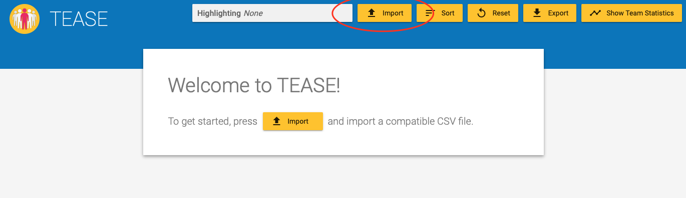
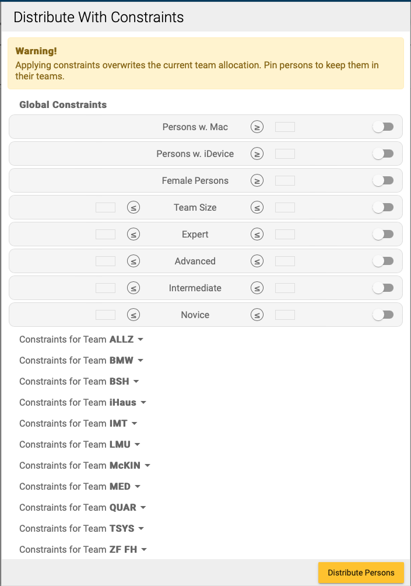

# TEASE Tool

## Prerequisites

1. Install [Docker](https://docs.docker.com/get-docker/)
2. Download the TEASE source code

## Starting the tool

```
cd tease/node
docker run -p 8080:80 --name tease team-allocator
```

You can stop the tool with `^C` (Ctrl + C). After waiting for a bit, open
[localhost:8080](https://localhost:8080).


Once the tool is running, you can import the team data. An example file is shipped with the source
code.
You can leave out data that you don't need for team allocation.



In **Distribute With Constraints** you can set global and team-specific constraints (e.g. minimum or maximum number
of experienced developers, female developers, developers with a mac, etc.).  
Developers can be pinned to a team and assigned manually.



The result can be exported as a csv file, which can later be imported again to change the team allocation.
Additionally team cards can be imported which generates images of the teams.

