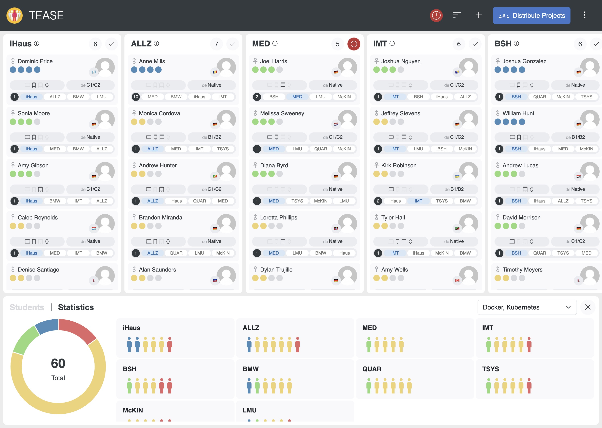
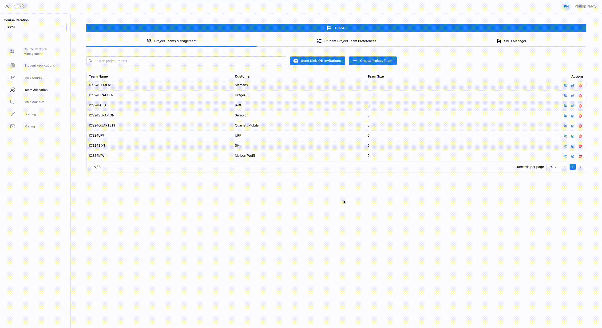

# Table of Contents

1. [Introduction](#introduction)
2. [User Guide](#user-guide)
3. [Installation](#installation)
4. [Development](#development)
5. [PROMPT Integration](#prompt-integration)
6. [Deployment](#deployment)

# Introduction

The **Team Allocator for Software Engineering courses (TEASE)** is an open source team allocation decision support system for project-based courses.
With TEASE one can [import](#import-data) student and project team data directly from [PROMPT](https://github.com/ls1intum/prompt), a support tool designed to assist program management in project-based courses, or from a [CSV](#csv-file) file.
Users can [create constraints](#constraints) based on factors such as skills, available development devices, gender, nationality, language proficiency, and team size.
The [matching algorithm](#matching-algorithm) evaluates all constraints and selects the allocation with the highest priority distribution.
[Statistics](#statistics) allow for detailed analysis and the ability to fine-tune allocations with manual adjustments.
The [live collaboration](#live-collaboration) feature enables multiple program managers to work on the same course iteration and update data in real time.
Once the allocation is complete, users can [export](#export-data) the data back to PROMPT, as a CSV file, or as images.

# User Guide

1. [Overview](#overview)
2. [Import Data](#import-data)
3. [Matching](#matching)
4. [Statistics](#statistics)
5. [Live Collaboration](#live-collaboration)
6. [Export Data](#export-data)

## Overview

To start using TEASE, import the student and project team data. After importing, users can create constraints for the matching algorithm, view statistics, and fine-tune the allocation through manual adjustments. When importing the same course iteration from PROMPT, multiple users can collaborate on it in real time. Once users finalize the allocation, they can export it back to PROMPT, as a CSV file for other project-related tasks, or as images for easy viewing.

### User Interface Layout

The main view of TEASE consists of 3 sections:

- **Navigation Bar**: The navigation bar provides access to various actions such as importing and exporting data, assigning students to project teams and creating constraints.
- **Project Team Section**: The Project Team section displays all project teams and their members. It shows the number of students in each team and whether the constraints are met.
- **The Utility Section**: The Utility Section provides access to the student pool, which contains all students not assigned to a project team. The statistics are within the same section. The entire section can be minimized when not in use.



## Import Data

TEASE offers two ways to import student and project team data:

- PROMPT
- CSV File

A sample dataset is also available for testing purposes.

### PROMPT

To use the PROMPT import, TEASE must be deployed on PROMPT.
For authentication and authorization, logging in to PROMPT as a program manager is mandatory for secure use of student data.
For detailed information about the PROMPT integration, see the [PROMPT Integration](#prompt-integration) section.

To ensure that the requirements are met, open TEASE with PROMPT from the team allocation section.
Once the requirements are met, TEASE will prompt the user to import the latest data from PROMPT.
In the import modal, users can select the specific course iteration to import.



### CSV File

To use the CSV File import, the use of a specific format is required.

| firstName | lastName | email                 | gender | id  | semester | studyDegree | studyProgram        | skillLevel   | language[de] | language[en] | nationality | projectPreference[TUM] | projectPreference[LMU] | skill[ML]    | skill[iOS]   | device[IPhone] | device[Mac] | device[IPad] | device[Watch] |
| --------- | -------- | --------------------- | ------ | --- | -------- | ----------- | ------------------- | ------------ | ------------ | ------------ | ----------- | ---------------------- | ---------------------- | ------------ | ------------ | -------------- | ----------- | ------------ | ------------- |
| Alice     | Smith    | alice.smith@email.com | Female | 001 | 3        | Master      | Information Systems | Advanced     | A1/A2        | Native       | US          | 0                      | 1                      | Novice       | Advanced     | true           | false       | true         | false         |
| Bob       | Johnson  | bob.johnson@email.com | Male   | 002 | 5        | Bachelor    | Information Systems | Intermediate | Native       | B1/B2        | DE          | 0                      | 1                      | Expert       | Advanced     | true           | true        | true         | true          |
| Carol     | Lee      | carol.lee@email.com   | Male   | 003 | 7        | Bachelor    | Computer Science    | Expert       | Native       | C1/C2        | DE          | 1                      | 0                      | Intermediate | Intermediate | true           | true        | false        | false         |

```
firstName,lastName,email,gender,id,semester,studyDegree,studyProgram,skillLevel,language[de],language[en],nationality,projectPreference[TUM],projectPreference[LMU],skill[ML],skill[iOS],device[IPhone],device[Mac],device[IPad],device[Watch]
Alice,Smith,alice.smith@email.com,Female,001,3,Master,Information Systems,Advanced,A1/A2,Native,US,0,1,Novice,Advanced,true,false,true,false
Bob,Johnson,bob.johnson@email.com,Male,002,5,Bachelor,Information Systems,Intermediate,Native,B1/B2,DE,0,1,Expert,Advanced,true,true,true,true
Carol,Lee,carol.lee@email.com,Male,003,7,Bachelor,Computer Science,Expert,Native,C1/C2,DE,1,0,Intermediate,Intermediate,true,true,false,false
```

- **Gender**: Female, Male, Other, Prefer not to say
- **Project preference**: 0, 1, 2, ... (0 is the highest Priority)
- **Skill proficiency**: Novice, Intermediate, Advanced, Expert
- **Language Proficency**: A1/A2, B1/B2, C1/C2, Native
- **Nationality Format**: ISO 3166-1 alpha-2
- **Language Format**: ISO 639-1
- **Device**: true, false
- **Supported Devices**: IPhone, Mac, IPad, Watch
- **Skill Names**: Any name is allowed
- **Project Team Names**: Any name is allowed

## Matching

After importing the data, all the students can be found in the student pool, located at the bottom of the screen in the utility section.
Students can be manually dragged and dropped into a project team, but the core functionality of the tool is to automatically match students to project teams.

It is important to create constraints for the matching algorithm to follow. Without constraints, the algorithm will match students based solely on their highest priorities, which can lead to uneven team sizes, skill distributions or other imbalances.


### Constraints

Constraints are crucial for the matching algorithm, as they determine how well the results meet the desired outcome.

A constraint consists of three parts: project selection, filter, and limits.

#### Project Selection

A constraint can be set for one or more project teams.
The constraint must be fullfilled for each project team.

#### Filter

A filter consists of a property and a value, with some filters using comparison operators for more customization. For example, intro course proficiency can use the "at least" operator to filter for students with a minimum skill proficiency level of advanced.

Filters can be defined based on the following properties:

- skill proficiencies
- development devices
- gender
- nationality
- language proficiencies
- intro course proficiency
- team size

Students are then dynamically filtered based on their properties.

#### Limits

Each constraint has an upper and lower limit that the selected project team must meet. These limits refer to the number of students who meet the filter criteria and are assigned to the project team.

### Matching Algorithm

The matching algorithm uses a linear programming approach to match students to projects using the defined constraints.
Each student is matched to exactly one project team, with the optimization objective focused on maximizing project preferences.
The algorithm generates only valid project team allocations.

### Constraint Summary

The Constraint Summary displays all existing constraints. It opens by clicking the "Distribute Projects" button in the navigation bar.

In this view, users can create new constraints using either the default constraint builder with the "Add Constraint" button or the nationality constraint builder with the "Add Nationality Constraints" button.

The overview shows each part of the constraints: the filter, the limits, and the selected projects. By clicking the three dots on the right, users can delete, edit, or deactivate a constraint, meaning it will not be used by the matching algorithm.

By pressing the "Distribute Teams" button, the matching algorithm distributes the allocation.


## Statistics

The Statistics section allows users to view detailed statistics about project teams and students. It uses different charts to visualize different metrics. Possible metrics to analyze include:

- Priority distribution
- Skill distributions (Intro Course Proficiency and other imported skills)
- Device distributions (iPhone, Mac, iPad, Watch)

The statistics are crucial for assessing the quality of the distribution and are helpful for analyzing and manually fine-tuning the results.


## Live Collaboration

The live collaboration feature updates all dynamic data in real-time between program managers.
This dynamic data includes students locked to project teams, project team allocations, and constraints.

To prevent misuse of the collaboration server, users must first log in to PROMPT.
Once logged in, authentication to the collaboration server happens automatically.
Currently this feature is available only for data imported from PROMPT.
Data synchronizes only between the same course iteration.
The imported course iteration appears in the navigation bar, with the live collaboration status displayed next to it.


## Export Data

TEASE offers three ways to export data:

- PROMPT Integration
- CSV File
- Images

### PROMPT

Similar to the import, to use the PROMPT export, TEASE must be deployed on PROMPT.
For authentication and authorization, logging in to PROMPT as a program manager is mandatory for secure use of student data.
For detailed information about the PROMPT integration, see the [PROMPT Integration](#prompt-integration) section.

To ensure that the requirements are met, open TEASE with PROMPT from the team allocation section.
Only data that has been imported from PROMPT can be exported back to PROMPT.
A message will appear indicating successful export.


### CSV File

The CSV export generates a CSV file with all student data and their corresponding project team allocations.

The file has the following format:

| Name        | Team |
| ----------- | ---- |
| Alice Smith | TUM  |
| Bob Johnson | LMU  |
| Carol Lee   | TUM  |

```
Name,Team
Alice Smith,TUM
Bob Johnson,LMU
Carol Lee,TUM
```

### Images

The image export generates a ZIP file containing a canvas of all project teams as displayed in the project team section of TEASE, along with individual images for each project team.

# Installation

To start the TEASE application, ensure Docker is installed on your system. You can follow the installation guide [here](https://docs.docker.com/engine/install/).

Once Docker is installed, follow these steps:

Navigate to the directory containing the `docker-compose.yml` file.

Run the following command in that directory to start the application:

```
docker compose up
```

Use `docker compose up --build` to build the images locally from the repository.

# Development

TEASE consists of a client and a server. The client is built with Angular, while the server utilizes Spring Boot with Java and functions as a STOMP WebSocket Broker.

## Client

In the client directory, run `npm install` to install all necessary dependencies.

To start the client, run `npm start` for a development server. After successful compilation, the client can be accessed at `http://localhost:80/`.

The application will automatically reload if you change any of the source files.

The PROMPT API is automatically generated using `npm run openapi:generate` and is documented in [openapi_spec.yaml](https://github.com/ls1intum/tease/blob/main/client/docs/openapi_spec.yaml). To explore and edit the API documentation, you can use the [Swagger Editor](https://editor.swagger.io/). All data objects used in TEASE are declared in this documentation.

## Server

In the server directory, run `mvn install` to install all necessary dependencies.

To start the server, run `mvn spring-boot:run`. After successful startup, the server can be accessed at `http://localhost:8081/`. The websocket server uses the STOMP messaging protocol to handle real-time communication and message exchange between clients and the server.

In general, there are four main STOMP paths:

- course-iteration/{id}/discovery
- course-iteration/{id}/allocations
- course-iteration/{id}/constraints
- course-iteration/{id}/locked-students

When a new client sends a message to the discovery channel, they receive all current states of the dynamic data through the other channels. Any message sent to the allocations, constraints, or locked-students channels will be broadcasted to all connected clients, updating them with the latest information.

# PROMPT Integration

[PROMPT](https://github.com/ls1intum/prompt) is a support tool designed to assist program management in project-based courses. TEASE integrates closely with PROMPT, enabling direct import and export of student and project team data. The API is documented with the OpenAPI Specification in [openapi_spec.yaml](https://github.com/ls1intum/tease/blob/main/client/docs/openapi_spec.yaml). To explore the API documentation use the [Swagger Editor](https://editor.swagger.io/).

To deploy TEASE alongside PROMPT, install both on the same machine. Start by deploying PROMPT first. Next, deploy TEASE into a directory named `tease`, which should be one level below the top-level directory where PROMPT is installed. This is where you'll find PROMPT's Docker Compose file. Detailed installation instructions for TEASE can be found in the [Installation](#installation) section.

# Deployment

Upon a new commit to the main branch in the TEASE repository, an automatic build pipeline is triggered.
This pipeline builds a new Docker image for TEASE. The image is then deployed to the same virtual machine that hosts PROMPT.
Once deployed, all incoming HTTP requests to the URL prompt.ase.cit.tum.de/tease are automatically routed to and served by the newly deployed TEASE Docker image running on the virtual machine.
To facilitate data exchange between PROMPT and TEASE, it is necessary to log in to PROMPT as a member of the project management team.
This step allows to import student data from PROMPT into TEASE and later export the allocation back to PROMPT.


